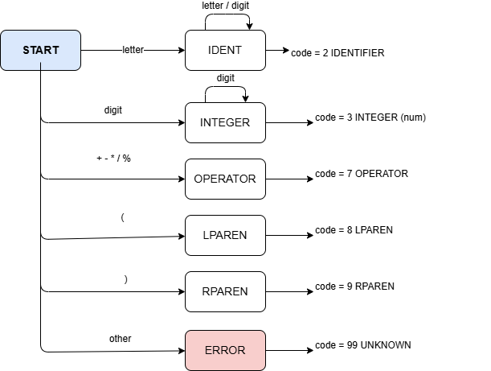
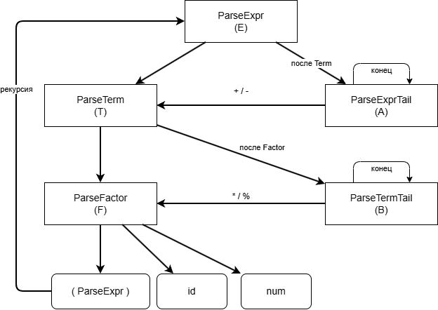
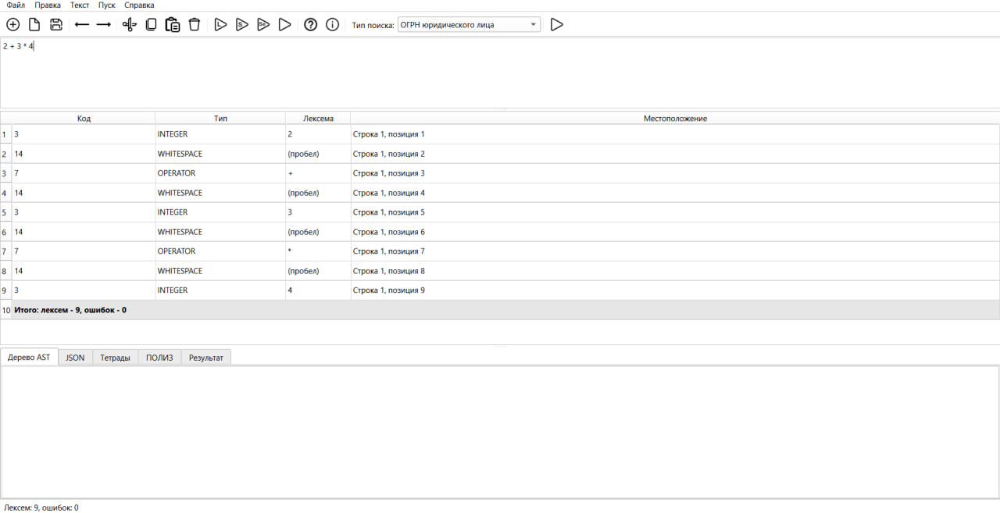
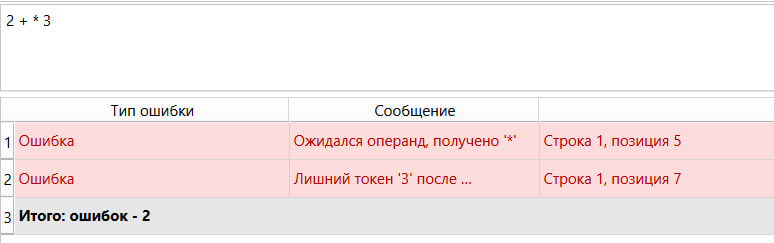
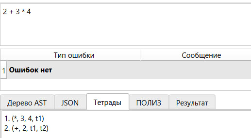
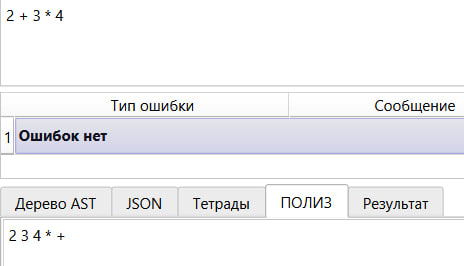
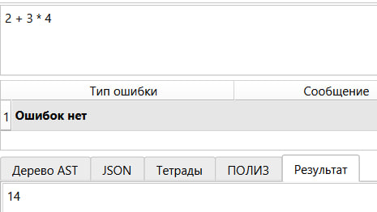

# Лабораторная работа №6 - Создание внутренней формы представления программы

## Цель работы
Изучить методы построения внутреннего представления программы (ВПП) на основе контекстно-свободной грамматики, реализовать синтаксический анализатор методом рекурсивного спуска и преобразовать арифметические выражения в тетрады и ПОЛИЗ.

## Автор
+ Башинов Арья Игоревич
+ Группа: АП-326

## Постановка задачи
Реализовать поиск лексических и синтаксических ошибок для заданной КС-грамматики методом рекурсивного спуска. Представить внутреннюю форму программы в виде тетрад `(op, arg1, arg2, result)`. Преобразовать выражение в ПОЛИЗ (польскую инверсную запись) и вычислить его значение.

## Вариант задания

**Язык: Java.**

Определение грамматики:
```
E → TA
A → ε | + TA | - TA
T → FB
B → ε | * FB | / FB | % FB
F → num | id | (E)
id → letter {letter | digit}
num → digit {digit}
```

### Обозначения
- `ε` - пустая строка;
- `letter` - `a-zA-Z`;
- `digit` - `0-9`;
- `num` - целое число;
- `id` - идентификатор.

### Операции
`+ - * / %`

### Примеры верных строк
```
2 + 3 * 4
(2 + 3) * 4
10 % 3
a + b * 2
2 * 3 + 4 * 5 - 6 / 2
((1 + 2) * (3 + 4))
```

## Диаграмма лексера



## Схема рекурсивного спуска



## Тестовые примеры работы лексера и парсера

### Корректное выражение (лексический анализ)
Входная строка:
```
2 + 3 * 4
```

Результат лексического анализа:



### Выражение с ошибкой (разбор арифметического выражения)
Входная строка:
```
2 + * 3
```

Результат разбора:



## Внутренняя форма представления программы (тетрады)

Тетрады строятся только для корректных выражений без ошибок.

### Пример: `2 + 3 * 4`

| № | op | arg1 | arg2 | result |
| --- | --- | --- | --- | --- |
| 1 | * | 3 | 4 | t1 |
| 2 | + | 2 | t1 | t2 |

Результат работы программы:



### Пример: `2 * 3 + 4 * 5 - 6 / 2`

| № | op | arg1 | arg2 | result |
| --- | --- | --- | --- | --- |
| 1 | * | 2 | 3 | t1 |
| 2 | * | 4 | 5 | t2 |
| 3 | + | t1 | t2 | t3 |
| 4 | / | 6 | 2 | t4 |
| 5 | - | t3 | t4 | t5 |

## ПОЛИЗ

ПОЛИЗ строится для всех корректных выражений. Вычисление выполняется только для выражений, состоящих исключительно из целых чисел.

### Пример: `2 + 3 * 4`

ПОЛИЗ:
```
2 3 4 * +
```

Результат работы программы (вкладка ПОЛИЗ):



### Вычисление значения

Значение выражения:
```
14
```

Результат работы программы (вкладка Результат):



### Пример с идентификаторами: `a + b * 2`

ПОЛИЗ:
```
a b 2 * +
```

Вычисление невозможно, так как выражение содержит идентификаторы. Выводится сообщение «Присутствуют идентификаторы».

## Формат вывода

После нажатия F9 (или выбора пункта «Пуск → Внутренняя форма программы»):

1. Выполняется лексический анализ.
2. Выполняется разбор арифметического выражения методом рекурсивного спуска.
3. Если найдены ошибки:
   - в таблице результатов выводятся ошибки с указанием сообщения и позиции;
   - во вкладках «Тетрады», «ПОЛИЗ», «Результат» выводится сообщение «Разбор не выполнен из-за ошибок».
4. Если ошибок нет:
   - на вкладке «Тетрады» выводится список тетрад;
   - на вкладке «ПОЛИЗ» выводится польская инверсная запись;
   - на вкладке «Результат» выводится значение (только для выражений из целых чисел).
5. В строке состояния выводится количество ошибок.

## Используемые технологии
+ Язык программирования: Python 3.10+
+ GUI-фреймворк: PySide6 (Qt for Python)
+ Среда разработки: Visual Studio Code

## Инструкция по сборке и запуску
Клонировать репозиторий:
```powershell
git clone https://github.com/korposs/TFYAK_Lab6.git
cd TFYAK_Lab6
```

Установить зависимости:
```powershell
py -m pip install -r requirements.txt
```

Запустить приложение:
```powershell
py main.py
```

В средах, где Python запускается командой `python`, использовать её вместо `py`.

## Структура проекта
```text
TFYAK_Lab6/
├── main.py                       # точка входа приложения
├── text_editor.py                # главное окно и логика интерфейса
├── requirements.txt
├── README.md
├── .gitignore
├── compiler/
│   ├── __init__.py
│   ├── grammar.py                # константы грамматики
│   ├── scanner.py                # лексический анализатор (ЛР2)
│   ├── parser.py                 # синтаксический анализатор record (ЛР3)
│   ├── regex_search.py           # поиск по регуляркам (ЛР4)
│   ├── ast_nodes.py              # узлы AST (ЛР5)
│   ├── semantic.py               # семантические проверки (ЛР5)
│   └── expr_parser.py            # ВПП: тетрады и ПОЛИЗ (ЛР6)
├── resources/
│   └── icons/                    # иконки панели инструментов
└── images/                       # иллюстрации для README
```

## Ограничения
+ Арифметические выражения обрабатываются отдельно от record-объявлений. При вводе `record Person(...)` и нажатии F9 разбор не выполняется.
+ Деление целочисленное (как в Python: `//`). Остаток от деления - оператор `%`.
+ Вычисление ПОЛИЗ возможно только для выражений, состоящих исключительно из целых чисел.
+ Пункты меню «Текст» открывают окна с краткими описаниями-заглушками.
+ Поддерживается работа с одним документом в одном окне.
+ Файлы читаются и сохраняются только в кодировке UTF-8.

## Вывод
В ходе лабораторной работы был успешно реализован модуль построения внутренней формы представления программы, который:
+ выполняет лексический анализ арифметических выражений;
+ выполняет синтаксический разбор методом рекурсивного спуска согласно заданной КС-грамматике;
+ обнаруживает лексические и синтаксические ошибки;
+ строит тетрады для корректных выражений;
+ строит ПОЛИЗ с использованием алгоритма сортировочной станции;
+ вычисляет значение выражения, состоящего только из целых чисел;
+ не строит тетрады и ПОЛИЗ при наличии ошибок;
+ интегрирован в графический интерфейс, разработанный в лабораторной работе №1.