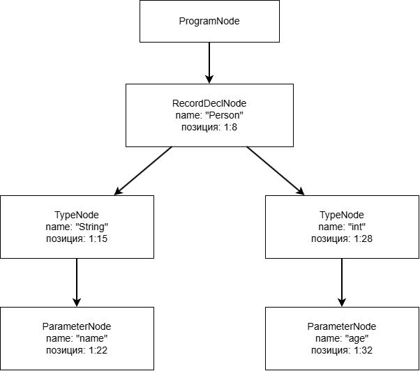
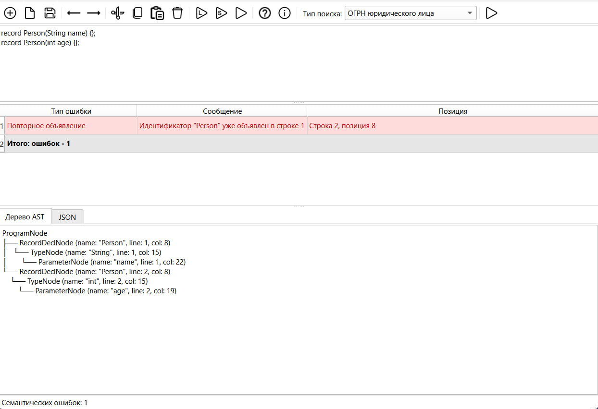
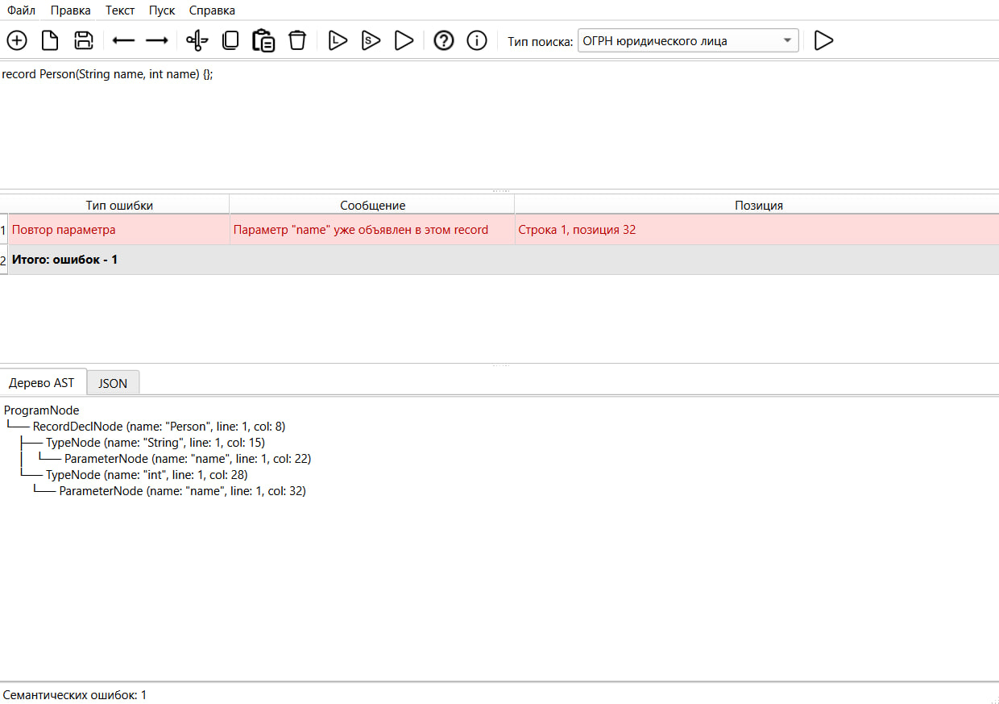
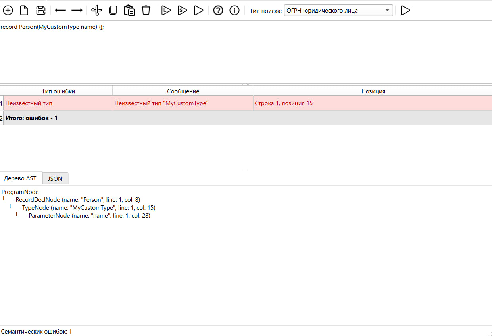
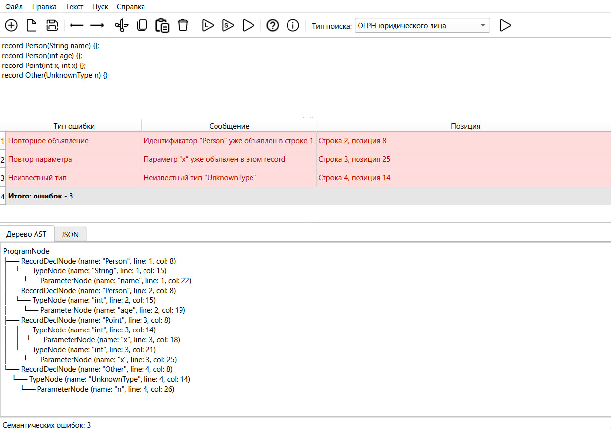
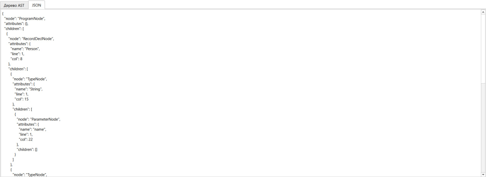
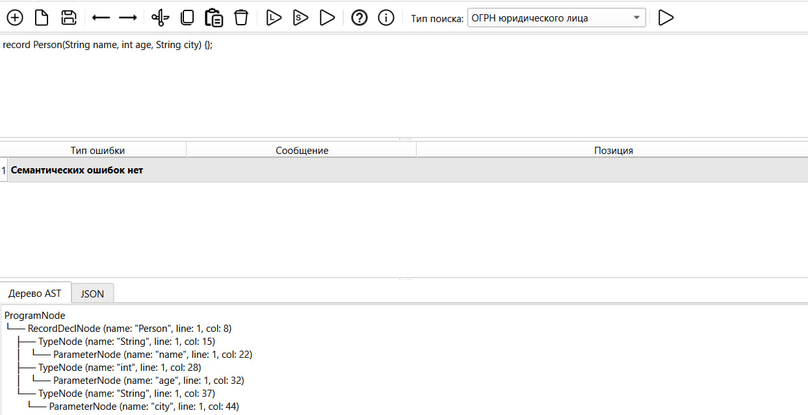

# Лабораторная работа №5 - Построение AST и проверка контекстно-зависимых условий

## Цель работы
Изучить назначение и принципы работы семантического анализатора в структуре компилятора. Освоить методы построения абстрактного синтаксического дерева (AST) и проверки контекстно-зависимых условий (семантических правил) для заданной синтаксической конструкции.

## Автор
+ Башинов Арья Игоревич
+ Группа: АП-326

## Постановка задачи
Развить ранее созданный синтаксический анализатор (парсер) до семантического: построить абстрактное синтаксическое дерево (AST) и реализовать проверку контекстно-зависимых условий в соответствии с индивидуальным вариантом курсовой работы.

## Вариант задания

**Номер варианта: 17.** Объявление структуры на языке Java.

Обрабатываемая конструкция:
```java
record Person(String name, int age, String city) {};
```

Record-структура состоит из:
- ключевого слова `record`;
- имени структуры (идентификатор);
- списка параметров в круглых скобках (может быть пустым);
- каждого параметра вида `Тип имя`;
- пустого тела в фигурных скобках;
- точки с запятой в конце.

Допустимые типы параметров: `String`, `int`, `long`, `double`, `float`, `boolean`, `char`, `byte`, `short`.

## Примеры корректных строк
```java
record Person(String name, int age, String city) {};
record Empty() {};
record Point(int x, int y) {};
```

## CST / AST (схема для корректной строки)



Схема построена для строки:
```java
record Person(String name, int age) {};
```

## Реализованные контекстно-зависимые условия

### 1. Уникальность имени record

**Описание.** Имя record не должно быть объявлено ранее в той же области видимости.

**Пример с ошибкой:**
```java
record Person(String name) {};
record Person(int age) {};
```

**Результат работы программы:**



### 2. Уникальность имён параметров внутри record

**Описание.** Внутри одного record не может быть двух параметров с одинаковым именем.

**Пример с ошибкой:**
```java
record Person(String name, int name) {};
```

**Результат работы программы:**



### 3. Допустимость типа параметра

**Описание.** Тип параметра должен входить в список допустимых типов. Неизвестные типы, отсутствующие в списке, диагностируются как семантическая ошибка.

**Пример с ошибкой:**
```java
record Person(MyCustomType name) {};
```

**Результат работы программы:**



### 4. Ограничение на количество параметров

**Описание.** Количество параметров record не должно превышать 255 (ограничение виртуальной машины Java на число компонентов).

**Пример с ошибкой** (не показан на скрине — требует более 255 параметров):
```java
record Person(int p1, int p2, ..., int p256) {};
```

## Пример с несколькими ошибками

```java
record Person(String name) {};
record Person(int age) {};
record Point(int x, int x) {};
record Other(UnknownType n) {};
```

Результат: 3 семантические ошибки — повторное объявление `Person`, повтор параметра `x`, неизвестный тип `UnknownType`.



## Структура AST

Типы узлов:

| Тип узла | Описание | Атрибуты |
| --- | --- | --- |
| `ProgramNode` | Корень дерева, содержит все объявления | нет |
| `RecordDeclNode` | Одно объявление record | `name`, `line`, `col` |
| `TypeNode` | Тип параметра | `name`, `line`, `col` |
| `ParameterNode` | Имя параметра | `name`, `line`, `col` |

Иерархия:
```
ProgramNode
└── RecordDeclNode
    ├── TypeNode
    │   └── ParameterNode
    └── TypeNode
        └── ParameterNode
```

## Пример AST

Для строки:
```java
record Person(String name, int age) {};
```

Текстовое представление дерева:
```
ProgramNode
└── RecordDeclNode (name: "Person", line: 1, col: 8)
    ├── TypeNode (name: "String", line: 1, col: 15)
    │   └── ParameterNode (name: "name", line: 1, col: 22)
    └── TypeNode (name: "int", line: 1, col: 28)
        └── ParameterNode (name: "age", line: 1, col: 32)
```

То же дерево в формате JSON:



## Формат вывода

После нажатия F8 (или выбора пункта «Пуск → Семантический анализ и AST»):

1. Выполняется лексический анализ, затем синтаксический.
2. При отсутствии синтаксических ошибок строится AST.
3. Выполняются семантические проверки.
4. В таблице результатов отображаются семантические ошибки с указанием типа, сообщения и позиции.
5. На вкладке «Дерево AST» выводится текстовое дерево.
6. На вкладке «JSON» выводится то же дерево в формате JSON.
7. В строке состояния выводится количество найденных ошибок.
8. При щелчке на строке ошибки курсор в редакторе устанавливается на проблемную позицию.

Если семантических ошибок нет, в таблице выводится сообщение «Семантических ошибок нет», а дерево всё равно строится.

### Пример корректного ввода

```java
record Person(String name, int age, String city) {};
```



## Используемые технологии
+ Язык программирования: Python 3.10+
+ GUI-фреймворк: PySide6 (Qt for Python)
+ Формат JSON для представления AST
+ Среда разработки: Visual Studio Code

## Инструкция по сборке и запуску
Клонировать репозиторий:
```powershell
git clone https://github.com/korposs/TFYAK_Lab5.git
cd TFYAK_Lab5
```

Установить зависимости:
```powershell
py -m pip install -r requirements.txt
```

Запустить приложение:
```powershell
py main.py
```

В средах, где Python запускается командой `python`, использовать её вместо `py`.

## Структура проекта
```text
TFYAK_Lab5/
├── main.py                       # точка входа приложения
├── text_editor.py                # главное окно и логика интерфейса
├── requirements.txt
├── README.md
├── .gitignore
├── compiler/
│   ├── __init__.py
│   ├── grammar.py                # константы грамматики
│   ├── scanner.py                # лексический анализатор (ЛР2)
│   ├── parser.py                 # синтаксический анализатор (ЛР3)
│   ├── regex_search.py           # поиск по регуляркам (ЛР4)
│   ├── ast_nodes.py              # узлы AST и построение дерева (ЛР5)
│   └── semantic.py               # таблица символов и семантические проверки (ЛР5)
├── resources/
│   └── icons/                    # иконки панели инструментов
└── images/                       # иллюстрации для README
```

## Ограничения
+ Пункты меню «Текст» открывают окна с краткими описаниями-заглушками.
+ Поддерживается работа с одним документом в одном окне.
+ Подсветка синтаксиса отсутствует.
+ Файлы читаются и сохраняются только в кодировке UTF-8.
+ Для варианта «Объявление структуры на языке Java» семантические правила «совместимость типов значений», «допустимые значения» и «использование объявленных идентификаторов» в исходной формулировке не применимы, так как в объявлении record отсутствуют инициализаторы и выражения. Реализованы эквивалентные проверки: уникальность имени record, уникальность имён параметров, допустимость типа параметра, ограничение на количество параметров.

## Вывод
В ходе лабораторной работы был успешно реализован семантический анализатор, который:
+ строит абстрактное синтаксическое дерево для последовательности объявлений record;
+ проверяет уникальность имён record в глобальной области видимости;
+ проверяет уникальность имён параметров внутри одного record;
+ проверяет допустимость типов параметров;
+ контролирует ограничение на количество параметров;
+ выводит AST в текстовом виде и в формате JSON;
+ выводит семантические ошибки с указанием типа, сообщения и позиции;
+ подсвечивает ошибочную позицию в редакторе по щелчку на строке таблицы;
+ интегрирован в графический интерфейс, разработанный в лабораторной работе №1.